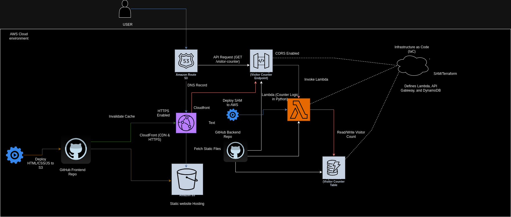

# 🌐 Cloud Resume Challenge

This project is part of the **Cloud Resume Challenge** by *Forrest Brazeal*. It demonstrates various AWS skills through the creation of a resume website. The project uses multiple AWS services to implement a serverless, scalable solution with CI/CD.

---

## 📝 Project Overview

The project involves a static resume website deployed on AWS, featuring a live visitor counter. Key AWS services include S3, CloudFront, Route 53, API Gateway, Lambda, and DynamoDB. The website is built with HTML and CSS, and it uses JavaScript to display the visitor count dynamically.

---

## 📐 Architecture Diagram



---

## 🛠 Technologies Used

- **AWS S3**: Static website hosting for HTML resume
- **AWS CloudFront**: CDN distribution with HTTPS for secure, global content delivery
- **Amazon Route 53**: DNS for custom domain routing
- **AWS API Gateway**: REST API to handle visitor counter requests
- **AWS Lambda**: Serverless compute to manage visitor counts
- **Amazon DynamoDB**: NoSQL database to store visitor count data
- **GitHub Actions**: CI/CD workflows for automated deployments

---

## ⚙️ Setup Instructions

Follow these steps to set up and deploy the project.

### 1. Prerequisites

- AWS account with appropriate IAM permissions
- **AWS CLI** configured locally
- **SAM CLI** for deploying serverless components
- **GitHub** account for source control and CI/CD

### 2. HTML/CSS Resume

1. Create the resume in **HTML** and style it with **CSS**.
2. Test the design locally to ensure it meets expectations.

### 3. S3 Setup for Static Website

1. Create an S3 bucket for static website hosting:
   ```bash
   aws s3api create-bucket --bucket your-resume-bucket --region us-east-1
   ```
##  Cloud Resume Deployment Guide

This guide walks you through deploying a serverless cloud resume website on AWS, focusing on automation, scalability, and CI/CD. It's a fantastic way to hone your AWS skills and embrace infrastructure as code (IaC).

###  Steps:

1. **Static Website Hosting:**
   - **Upload HTML & CSS to S3:**
     ```
     aws s3 cp <path-to-your-website-files> s3://<your-bucket-name> --recursive
     ```
   - **Set Public Accessibility:**
     ```
     aws s3api put-bucket-acl --acl public-read --bucket <your-bucket-name>
     ```

2. **Secure Delivery with CloudFront:**
   - **Create CloudFront Distribution:**
     - Origin: `<your-bucket-name>.s3.<region>.amazonaws.com>`
   - **Enable HTTPS:**
     - Request/attach a certificate from AWS Certificate Manager (ACM).
   - **Configure HTTP to HTTPS Redirection:**
     - Enforce secure connections.

3. **Route 53 DNS Setup:**
   - **Purchase/Use Existing Domain:**
     - `your-cloud-resume.com` (example)
   - **Create Hosted Zone:**
     - Configure DNS records for your domain.
   - **Point DNS Records:**
     - A record: `<your-distribution-domain-name>.cloudfront.net`

4. **Visitor Counter API:**
   - **DynamoDB Table (`visitorCounter`):**
     - Partition key: `id` (String)
   - **Lambda Function:**
     - Reads and updates visitor count in DynamoDB.
   - **API Gateway:**
     - REST API to expose the Lambda function.
     - Enable CORS for website access.
     - Integrate Lambda with API Gateway (`/visitor-counter` endpoint).

5. **JavaScript for Visitor Counter:**
   - **HTML Integration:**
     - Call the API Gateway endpoint to fetch and display visitor count dynamically.

6. **Continuous Integration & Deployment (CI/CD):**
   - **GitHub Actions:**
     - **Backend (Lambda & API):**
       - Repository: `<your-backend-code-repo>`
       - Workflow:
         - Run tests on code changes.
         - Deploy with AWS Serverless Application Model (SAM).
     - **Frontend (HTML/CSS):**
       - Repository: `<your-frontend-code-repo>`
       - Workflow:
         - Upload files to S3 on commits.
         - Invalidate CloudFront cache to deploy updates.

7. **🧪 Testing and Verification:**
   - **S3 Bucket Accessibility:**
     - Verify website accessibility from the S3 bucket.
   - **CloudFront HTTPS:**
     - Ensure HTTPS enforcement and secure website loading.
   - **API Testing:**
     - Use Postman/CURL to test API Gateway endpoint and Lambda functionality.
   - **Visitor Counter:**
     - Verify counter updates on page refresh.

8. **🧩 Challenges and Solutions:**
   - **CORS Issues:**
     - Enabled CORS on API Gateway.
   - **SSL Configuration:**
     - Used AWS Certificate Manager for CloudFront security.
   - **CI/CD Workflows:**
     - Configured GitHub Actions for deployment without storing credentials in version control.

9. **📈 Future Improvements:**
   - **Caching:**
     - Reduce Lambda/DynamoDB invocations.
   - **Visitor Tracking:**
     - Integrate unique visitor counts and geographical data.
   - **AWS Amplify:**
     - Explore for additional analytics and backend services.

10. **🚀 Conclusion:**
   - This project demonstrates a serverless application on AWS, showcasing automation, scalability, and CI/CD. It's a valuable learning experience for practicing cloud-based infrastructure management.

11. **🛡️ Acknowledgments:**
   - **Forrest Brazeal** for creating the Cloud Resume Challenge.

12. **🔗 Resources:**
   - AWS Cloud Practitioner Certification
   - AWS Solutions Architect Associate Certification
   - Programming concepts
   - Serverless Application Model (SAM) CLI Documentation
   - GitHub Actions Documentation
